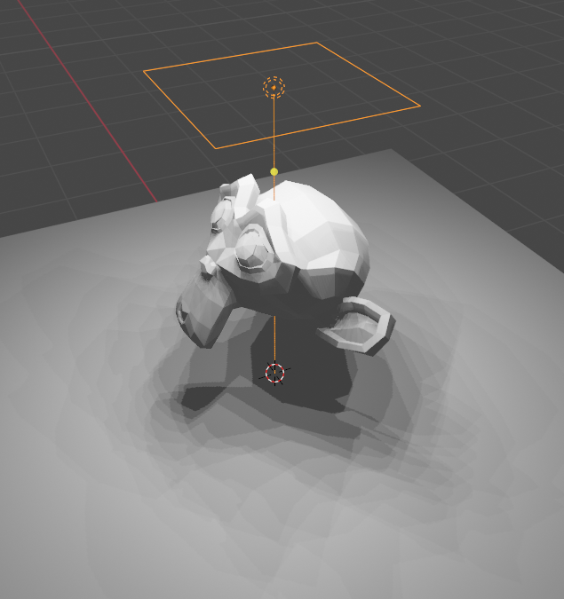
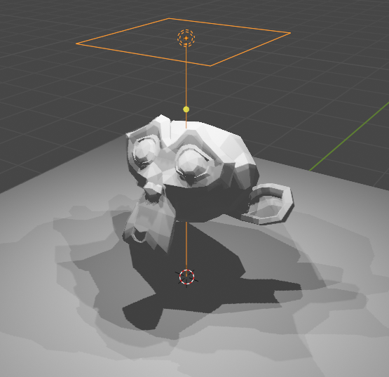
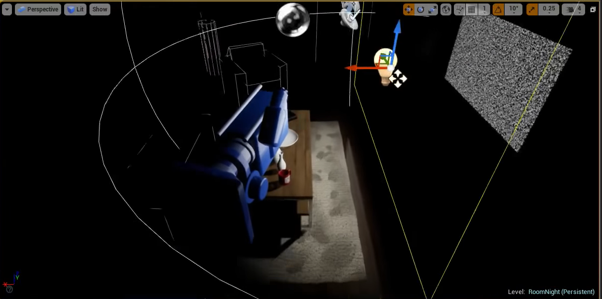

## Area Lights in Eevee

Area lights in Eevee seem to approximate it as a collection of point lights on the area.

<figure>
    
    <figcaption>The overlapping shadow maps are visible in the plane</figcaption>
</figure>

Internally it might be computing the shadow maps for each of these "assumed point lights" or somehow approximating by displacing a single shadow map. Or it could be mix of both these tricks. (Will update if I ever dig into the source code)  
Since Eevee is not a game engine but a close to real-time engine for lookdev it only renders that many shadow maps when the camera stays still for a few seconds.  
When the camera is moving it renders fewer shadow maps.

<figure>
    
    <figcaption>The overlapping shadow maps are lower quality while I'm moving the view camera</figcaption>
</figure>

## Area Lights in Unreal

Area lights in Unreal Engine is very similar to a Point Light, except a few differences I noticed:
* Area light doesnt cast a harsh specular hightlight like the point light
* The rectangle that forms the area light is visible in refections instead of the reflection of a point/sphere.
* The shadows are a bit softer(Ok, maybe not)

<figure>
    
    <figcaption>The shadow of the foot of the table looks like that cast by a point light</figcaption>
</figure>