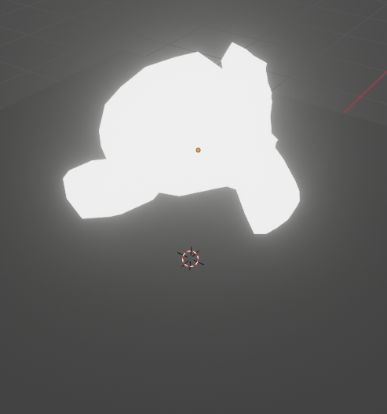
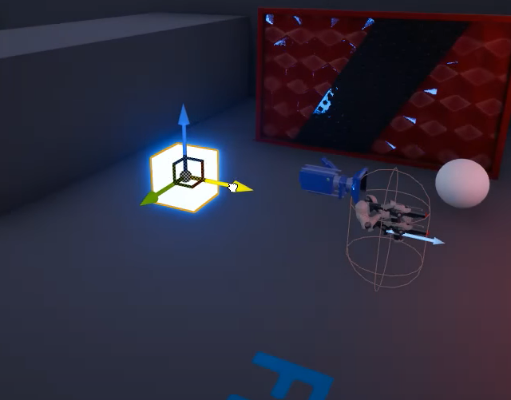
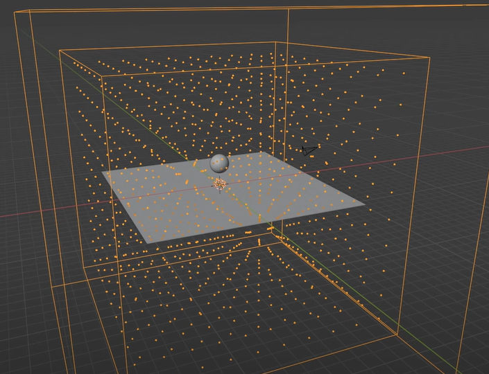
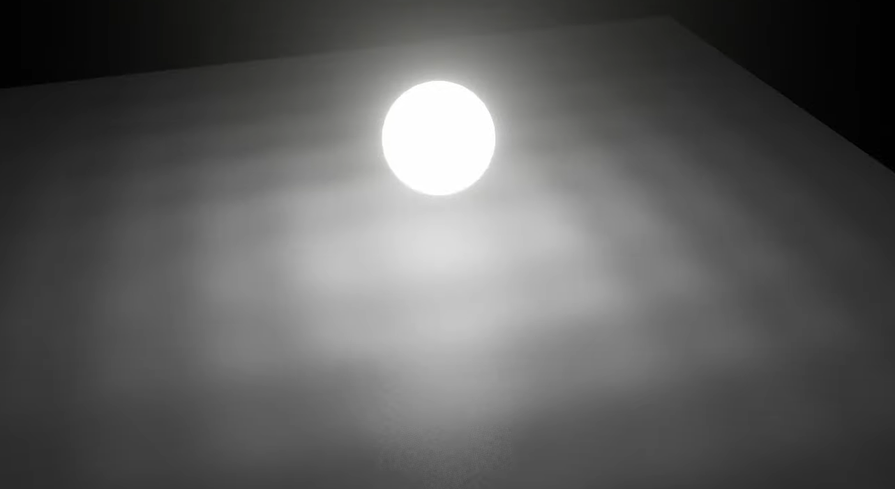

## Emission Shader
Emission shader does not cast light onto surfaces in eevee/unreal engine

<figure>
    
    <figcaption>Eevee</figcaption>
</figure>
<figure>
    
    <figcaption>Unreal Engine</figcaption>
</figure>

Although it does seem to reflect these shaders in shiny surfaces.

If you really want these to cast light you would have to bake to an irradiance field. 

<figure>
    
    <figcaption>Irradiance field setup in Blender</figcaption>
</figure>

<figure>
    
    <figcaption>Irradiance field Eevee result</figcaption>
</figure>

As you can see the results are not very pleasing with low resolution fields.
Increasing resolution increases bake time considerably.  
Unreal Engine might have a similar setup(haven't checked).

